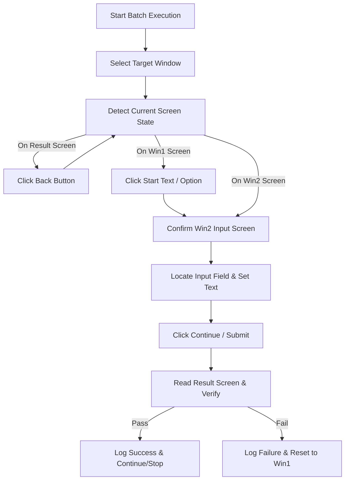

# Input Automation Tool (SmartActiveTools)

> **A powerful, intelligent Windows automation and batch testing tool powered by native Windows OCR and UI Automation.**

## 📌 Overview

**Input Automation Tool** (SmartActiveTools) is a specialized Windows desktop application designed to automate multi-step verification, form submission, and batch testing (such as activation key validation or automated string entry).

Unlike traditional automation frameworks that rely strictly on standard Windows UI Automation (UIA) accessibility trees—which fail on custom-rendered engines like DirectX, OpenGL, or custom game UIs—Input Automation Tool integrates **native Windows OCR (`Windows.Media.Ocr`)** alongside **fuzzy text matching** and **geometric input field detection**. This enables robust, automated interaction with any application window, even those that expose no UIA elements.

---

## ✨ Key Features

- 🔍 **Dual Driver Architecture (`IScreenDriver`)**
  - **UIA Driver (`UiaScreenDriver`)**: Native Windows UI Automation engine for standard Windows controls.
  - **OCR Driver (`OcrScreenDriver`)**: Built-in Windows Media OCR engine for custom-rendered, non-UIA desktop applications.
- 🎯 **Smart Window Auto-Selection**: Automatically detects and locks onto target windows by process title prefix (e.g., `Product Activation`).
- 🔤 **Fuzzy Text Matching (`FuzzyMatch`)**: Uses Levenshtein distance matching to reliably recognize UI labels and buttons even with minor font rendering or OCR artifacts.
- ⚡ **Multiple Input Methods**: Supports input entry via Clipboard Paste, Character Typing (Unicode `SendInput`), Hardware Scan Codes, and On-Screen Paste Button clicks.
- 🔄 **State Machine Workflow (`AutomationEngine`)**: Automatically navigates multi-screen flows (`Initial Screen` ➔ `Input Screen` ➔ `Verification / Review Screen`).
- ⏸️ **Interactive Execution Control**: Real-time Pause, Resume, Stop, and customizable step timeouts with interactive manual override prompts (`Retry`, `Skip/Continue`, `Abort`).
- 📊 **Batch Testing & Log Monitoring**: Process hundreds of test strings sequentially with live color-coded status logging and progress tracking.
- 💾 **Clean Configuration & Persistence**: Automatically saves custom configurations to `%AppData%\InputAutomationTool\settings.json` while stripping defaults for clean localization.
- 🛠️ **Built-in Diagnostic Tools**: One-click UIA & OCR visual element tree dumper for rapid debugging of target app interfaces.

---

## 🏗️ Architecture & Project Structure

The project is structured following clean architectural principles with a strict separation between core business logic and presentation layers:

```
SmartActiveTools/
├── InputAutomationTool.slnx            # Solution definition file
└── src/
    ├── Core/                            # InputAutomationTool.Core (.NET 10 Class Library)
    │   ├── AutomationEngine.cs          # State machine driving workflow & batch execution
    │   ├── AutomationConfig.cs          # Configuration model & clean default management
    │   ├── IScreenDriver.cs             # Driver interface abstraction
    │   ├── OcrScreenDriver.cs           # OCR-based screen interaction driver
    │   ├── UiaScreenDriver.cs           # Windows UI Automation driver
    │   ├── OcrTextReader.cs             # Offline Windows.Media.Ocr integration wrapper
    │   ├── ScreenCapture.cs             # High-performance Win32 screen capture helper
    │   ├── FuzzyMatch.cs                # String distance & fuzzy search algorithms
    │   ├── PauseTokenSource.cs          # Thread-safe async pause/resume token
    │   ├── Models.cs                    # TargetWindow, UiElement, TestResult data models
    │   └── DetectionDefaults.cs         # Default UI text fallbacks & screen markers
    └── App/                             # InputAutomationTool.App (WPF Desktop App)
        ├── MainWindow.xaml (.cs)        # Modern WPF user interface layout
        ├── MainViewModel.cs             # MVVM ViewModel handling async operations & UI binding
        ├── SettingsStore.cs             # Configuration persistence to %AppData%
        ├── Converters.cs                # WPF Value Converters for UI status formatting
        ├── Mvvm.cs                      # Lightweight ObservableObject & RelayCommand implementation
        └── app.manifest                 # Windows application manifest (DPI & privileges)
```

---

## ⚙️ How It Works (Workflow Engine)



1. **Window Identification**: The driver enumerates top-level Win32 windows and matches the configured target process title.
2. **Screen State Detection**: Analyzes screen text to determine if the target application is on the Start screen (`Win1`), Input screen (`Win2`), or Result screen (`Win3`).
3. **Automated Input & Submission**: Locates input controls geometrically relative to labels or OCR anchor points and enters test strings.
4. **Verification & Exception Recovery**: Waits for result verification, handles timeouts, and offers interactive prompts if step verification fails.

---

## 🚀 Prerequisites & System Requirements

- **Operating System**: Windows 10 (Build 19041+) or Windows 11 (x64 / ARM64).
- **Runtime**: .NET 10.0 Desktop Runtime (or SDK to build from source).
- **OCR Support**: Windows Media OCR (`Windows.Media.Ocr`). Ensure a language pack corresponding to your OS user profile language is installed in Windows Settings.

---

## 🛠️ Building & Running

### Building via .NET CLI

1. **Clone the repository**:
   ```bash
   git clone <repository-url>
   cd SmartActiveTools
   ```

2. **Build the solution**:
   ```bash
   dotnet build src/App/InputAutomationTool.App.csproj -c Release
   ```

3. **Run the application**:
   ```bash
   dotnet run --project src/App/InputAutomationTool.App.csproj
   ```

### Building via Visual Studio

1. Open `InputAutomationTool.slnx` in **Visual Studio 2022** (v17.10 or newer with .NET 10 SDK installed).
2. Set `InputAutomationTool.App` as the Startup Project.
3. Build and press **F5** to run.

---

## 📖 Configuration Reference

All run settings are managed through the UI and persisted to `%AppData%\InputAutomationTool\settings.json`:

| Property | Default Value | Description |
| :--- | :--- | :--- |
| `WindowDetectName` | `Product Activation` | Target window title prefix for auto-selection |
| `Win1DetectText` | `Use a purchased activation key` | Anchor text for the initial screen |
| `Win2DetectText` | `Activation key` | Anchor text for the input form screen |
| `Win3DetectText` | `Activation failed` | Anchor text marking a failed attempt |
| `Win3ReviewText` | `Review your activation details` | Text for review screen requiring final activation |
| `ActivateButtonText`| `Activate` | Button text to click on review screen |
| `SuccessText` | `Success` | Success verification marker text |
| `StopOnFirstSuccess`| `true` | Halt batch run upon finding the first valid input |
| `DetectRetries` | `3` | Number of screen refresh attempts per step |
| `DetectRetryDelayMs`| `1000` | Delay (ms) between screen detection retries |
| `VerifySeconds` | `10` | Maximum wait time (seconds) for result screen verification |

---

## 📄 License

This project is licensed under the MIT License. See the LICENSE file for details.
