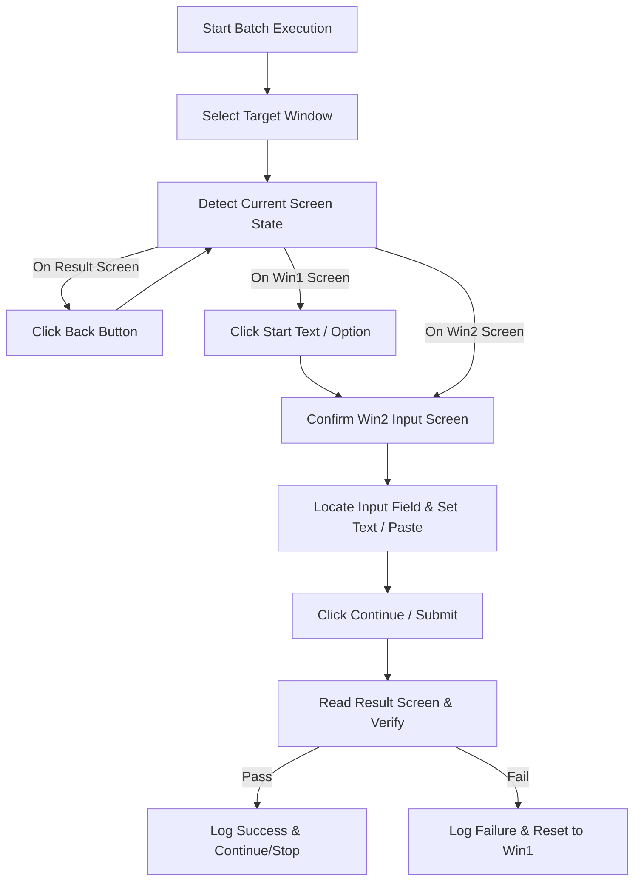

# Input Automation Tool (SmartActiveTools)

> **A powerful, intelligent Windows automation and batch testing tool powered by native Windows OCR and UI Automation.**

## 📌 Overview

**Input Automation Tool** (SmartActiveTools) is a specialized Windows desktop application designed to automate multi-step verification, form submission, and batch testing (such as activation key validation or automated string entry).

Unlike traditional automation frameworks that rely strictly on standard Windows UI Automation (UIA) accessibility trees—which fail on custom-rendered engines like DirectX, OpenGL, or custom game UIs—Input Automation Tool integrates **native Windows OCR (`Windows.Media.Ocr`)** alongside **fuzzy text matching**, **geometric input field detection**, **image contrast enhancement**, and **interactive visual selection tools**. This enables robust, automated interaction with any application window, even those that expose no UIA elements.

---

## ✨ Key Features

- 🔍 **Dual Driver Architecture (`IScreenDriver`)**
  - **UIA Driver (`UiaScreenDriver`)**: Native Windows UI Automation engine for standard Windows controls.
  - **OCR Driver (`OcrScreenDriver`)**: Built-in Windows Media OCR engine with fuzzy text matching for custom-rendered, non-UIA desktop applications.
- 🎯 **Smart Window Auto-Selection**: Automatically detects and locks onto target windows by process title prefix (e.g., `Product Activation`) with live process list enumeration.
- 🌐 **Language Presets (`LanguagePresets`)**: Built-in UI language preset system with automatic fallback resolution to seamlessly target non-English application interfaces without manual string entry.
- 🖼️ **OCR Image Processing Pipeline (`OcrImageProcessing`)**: Advanced pre-processing engine featuring automatic input-box cropping, grayscale conversion, darken filtering, contrast matrix adjustment, and 2x bicubic resampling to maximize OCR recognition accuracy on styled or anti-aliased fonts.
- 🎯 **Interactive Visual Paste Picker (`PastePickerWindow`)**: Full-screen, transparent per-monitor DPI-aware overlay allowing users to visually click their target app's Paste button, automatically calculating coordinate offsets relative to OCR anchor text in real-time.
- ⚡ **Multiple Input Entry Methods**:
  - **Paste**: Standard clipboard + `Ctrl+V` key combo.
  - **Type**: Unicode character typing using Win32 `SendInput`.
  - **ScanCode**: Hardware key scan code simulation for game engines and custom DirectX/OpenGL controls.
  - **PasteButton**: Simulated mouse click directly on the on-screen Paste button.
- 🧰 **Built-in Visual Diagnostic & Debug Tools**:
  - **OCR Debug Window (`OcrDebugWindow`)**: Capture delayed snapshots (3s timer), crop input regions, compare raw vs enhanced OCR outputs side-by-side, and export diagnostic images (`ocr-capture-normal.png` / `ocr-capture-enhanced.png`).
  - **Element Tree Dumper**: One-click UIA element tree inspection for rapid target control discovery.
- 🧠 **Machine-Scoped Offset Memory**: Automatically remembers scanned paste offsets on the current PC (`RememberedPasteMachine`) so subsequent automation runs bypass coordinate discovery scans.
- 🔄 **State Machine Workflow (`AutomationEngine`)**: Automatically navigates multi-screen flows (`Win1 Initial Screen` ➔ `Win2 Input Screen` ➔ `Win3 Verification / Review Screen`).
- ⏸️ **Interactive Execution Control**: Real-time Pause, Resume, Stop, and customizable step timeouts with interactive manual override prompts (`Retry`, `Skip/Continue`, `Abort`).
- 🎛️ **Mutually Exclusive Run Modes**: Clean toggle logic between *Stop on First Success* and *Test All Inputs*.
- 📊 **Batch Testing & Live Logging**: Process hundreds of test keys sequentially with live color-coded status logging, configurable delays (`Delay between next key`), and real-time progress indicators.
- 💾 **Multi-Location Configuration & Auto-Save**: Searches for `settings.json` across app directory, working directory, and `%AppData%\InputAutomationTool\settings.json` with startup diagnostic logging, automatic default fallback resolution, and auto-saving on setting modifications or exit.

---

## 🏗️ Architecture & Project Structure

The project is structured following clean architectural principles with strict separation between core business logic and presentation layers:

```
SmartActiveTools/
├── InputAutomationTool.slnx            # Solution definition file
├── publish/                            # Output directory for standalone single-file executable
└── src/
    ├── Core/                            # InputAutomationTool.Core (.NET 10 Class Library)
    │   ├── AutomationEngine.cs          # State machine driving workflow & batch execution
    │   ├── AutomationConfig.cs          # Configuration model & clean default management
    │   ├── IScreenDriver.cs             # Driver interface abstraction (UIA vs OCR)
    │   ├── UiaScreenDriver.cs           # Windows UI Automation driver
    │   ├── OcrScreenDriver.cs           # OCR-based screen interaction & coordinate driver
    │   ├── OcrTextReader.cs             # Offline Windows.Media.Ocr integration wrapper
    │   ├── OcrImageProcessing.cs        # Grayscale, contrast matrix, & 2x resampling pipeline
    │   ├── PasteGeometry.cs             # Shared coordinate origin & offset parsing geometry
    │   ├── LanguagePresets.cs           # Multilingual string presets & fallback manager
    │   ├── ScreenCapture.cs             # High-performance Win32 screen capture helper
    │   ├── FuzzyMatch.cs                # Levenshtein string distance & fuzzy search algorithms
    │   ├── PauseTokenSource.cs          # Thread-safe async pause/resume token
    │   └── Models.cs                    # TargetWindow, UiElement, TestResult data models
    └── App/                             # InputAutomationTool.App (WPF Desktop App)
        ├── MainWindow.xaml (.cs)        # Modern WPF user interface layout & VM bindings
        ├── MainViewModel.cs             # MVVM ViewModel handling async operations & UI state
        ├── SettingsStore.cs             # Multi-location configuration persistence & diagnostics
        ├── PastePickerWindow.xaml (.cs) # Transparent full-screen interactive paste coordinate picker
        ├── OcrDebugWindow.xaml (.cs)    # Diagnostic OCR window with delayed capture & side-by-side view
        ├── Converters.cs                # WPF Value Converters for UI status formatting
        ├── Mvvm.cs                      # Lightweight ObservableObject & RelayCommand implementation
        └── app.manifest                 # Windows application manifest (DPI & elevated privileges)
```

---

## ⚙️ How It Works (Workflow Engine)



1. **Window Identification**: The driver enumerates top-level Win32 windows and matches the configured target process title.
2. **Screen State Detection**: Analyzes screen text using UIA or OCR to determine if the target application is on the Start screen (`Win1`), Input screen (`Win2`), or Result screen (`Win3`).
3. **Automated Input & Submission**: Locates input controls geometrically relative to labels, OCR anchor points, custom paste button offsets (`CustomPasteDx/Dy`), or remembered machine offsets.
4. **Verification & Exception Recovery**: Waits for result verification, handles timeouts, and offers interactive prompts (`Retry`, `Continue`, `Abort`) if step verification fails.

---

## 🚀 Prerequisites & System Requirements

- **Operating System**: Windows 10 (Build 19041+) or Windows 11 (x64 / ARM64).
- **Runtime**: .NET 10.0 Desktop Runtime (or SDK to build from source).
- **OCR Support**: Windows Media OCR (`Windows.Media.Ocr`). Ensure a language pack corresponding to your OS user profile language is installed in Windows Settings.

---

## 🛠️ Building & Running

### Building via .NET CLI

1. **Clone the repository**:
   ```bash
   git clone <repository-url>
   cd SmartActiveTools
   ```

2. **Build the solution**:
   ```bash
   dotnet build src/App/InputAutomationTool.App.csproj -c Release
   ```

3. **Publish Standalone Executable**:
   ```bash
   dotnet publish src/App/InputAutomationTool.App.csproj /p:PublishProfile=SingleExe
   ```
   The generated single-file executable will be saved in `./publish/InputAutomationTool.exe`.

---

## 📖 Configuration Reference (`settings.json`)

Settings are loaded automatically from the application directory, current directory, or `%AppData%\InputAutomationTool\settings.json`:

| Property | Default Value | Description |
| :--- | :--- | :--- |
| `WindowDetectName` | `Product Activation` | Target window title prefix for auto-selection |
| `Win1DetectText` | `Use a purchased activation key` | Anchor text for the initial screen |
| `Win2DetectText` | `Activation key` | Anchor text for the input form screen |
| `Win3FailText` | `Activation failed` | Anchor text marking a failed attempt |
| `Win3SuccText` | `Review your activation details` | Text for review screen requiring final activation |
| `ActivateButtonText`| `Activate` | Button text to click on review screen |
| `ContinueButtonText`| `Continue` | Button text to click on input form screen |
| `BackButtonText` | `Back` | Button text to click to return from result screen |
| `SuccessText` | `Success` | Success verification marker text |
| `UseOcr` | `false` | Enable OCR screen driver instead of Windows UIA driver |
| `InputMethod` | `Paste` (`0`) | Input entry method (`Paste`, `Type`, `ScanCode`, `PasteButton`) |
| `InputOffsetX` / `Y` | `0` / `0` | Extra pixel fine-tuning offsets added to input field position |
| `InputProbeShift` | `false` | Downward 5x probe verifying field text via OCR |
| `UseCustomPastePosition`| `false` | Use hand-picked custom paste button offset position |
| `CustomPasteDx` / `Dy` | `0` / `0` | X/Y pixel offset relative to Win2 label anchor |
| `SkipPasteVerify` | `false` | Click paste button and proceed immediately without OCR verification |
| `RememberedPasteDx`/`Dy`| `null` | Machine-cached paste offset from previous successful 2D scan |
| `RememberedPasteMachine`| `""` | Host machine name for validating remembered paste offset |
| `StopOnFirstSuccess`| `true` | Halt batch run upon finding the first valid input key |
| `ContinueTestingAll`| `false` | Continue testing all keys regardless of success/failure |
| `DetectRetries` | `3` | Number of screen refresh attempts per step |
| `DetectRetryDelayMs`| `1000` | Delay (ms) between screen detection retries |
| `VerifySeconds` | `10` | Maximum wait time (seconds) for result screen verification |
| `BetweenCasesDelayMs`| `0` | Delay between next key (ms) before starting the next test key |
| `StepTimeoutSeconds`| `1` | Timeout (seconds) for individual action steps |
| `PollIntervalMs` | `250` | Polling interval (ms) for screen element checks |

---

## 📄 License

This project is licensed under the MIT License. See the LICENSE file for details.
